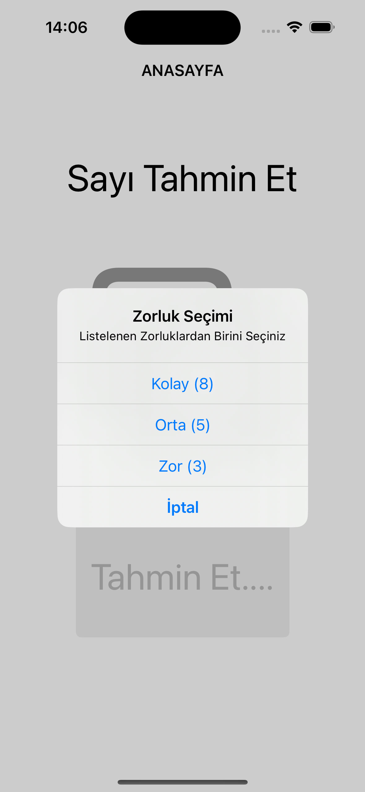
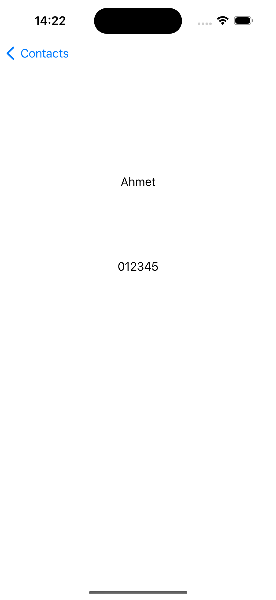
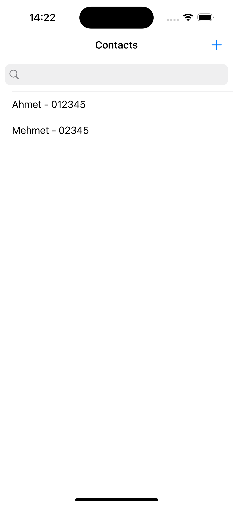
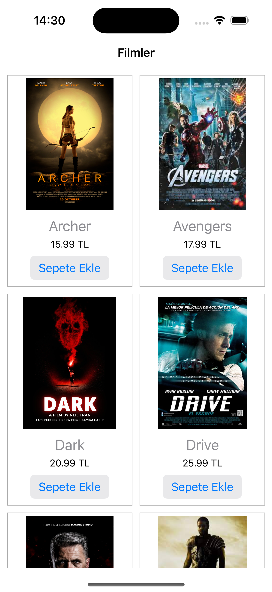
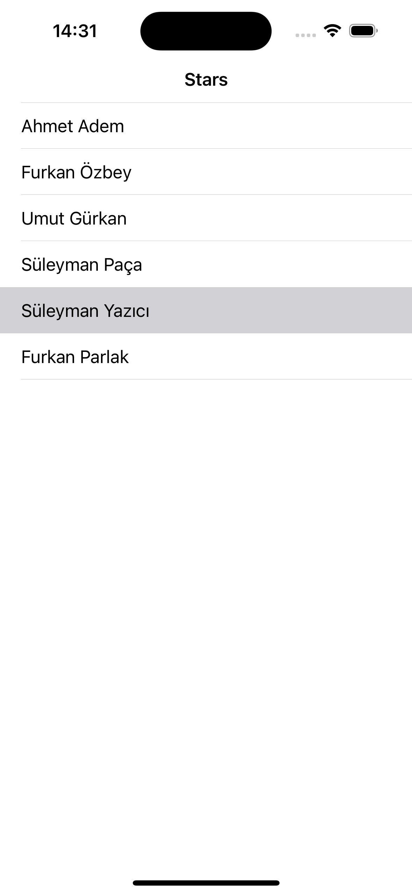
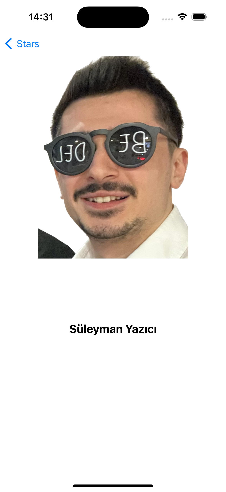
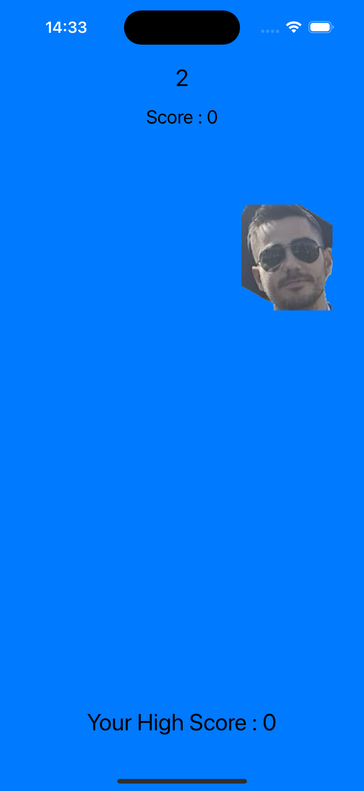
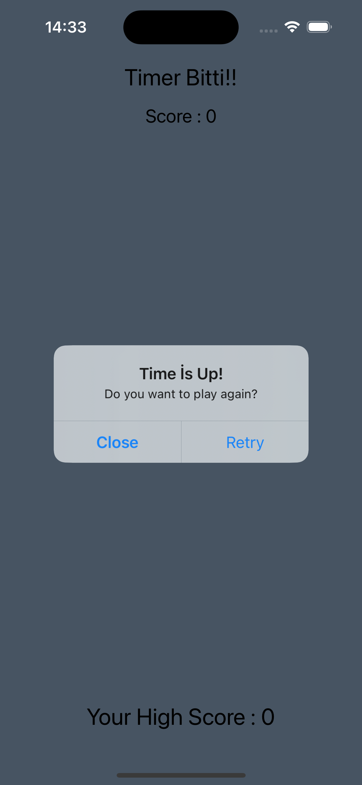
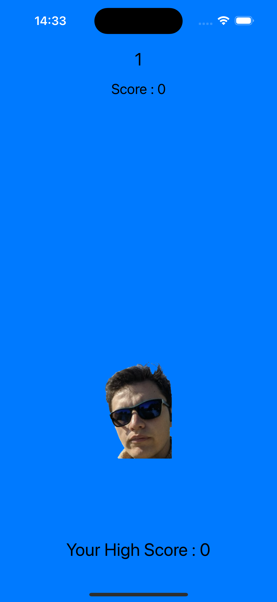

# Exercises

# iOS  Alıştırmalar 💻

- IOS developer olma sürecinde ilk olarak BTK Akademi sitesinde bulunan Atil SAMANCIOGLU-Swift ile IOS Programlama dersleri ile başladım. Devamında Udemy de bulunan Kasım ADALAN hocanın iOS Mobil Uygulama Gelistirme Egitimi ile devam ettim. Bu iki eğitimde öğrendiklerimi pekiştirmek ve kendimi geliştirmek adına eğitimlerde bulunan uygulamalara kendimce yaptığım eklemelerle ortaya çıkardığım bir repo dur.

## Projenin Amacı ⁉️

Swift ile ilgili temel konuları not alarak ve örneklerle bu işlemi pekiştirmek adına yaptığım bir çalışmadır. Öğrendiklerimi farklı projeler geliştirmek amacıyla oluşturulmuş bir projeler bütünüdür.

## Proje İçeriği 🎁

Swift e  BTK Akademiden Atıl SAMANCIOGLU Hocanın Swift ile IOS Programlama dersleri ile başlangıç yaptım. Kendimi bu alanda dahada ileriye götürmek için Udemy den Kasım ADALAN hocanın iOS Mobil Uygulama Gelistirme Egitimi ile devam ettim. Bu eğitimler içerisinde bulunan egzersizlerle kendimi geliştirmeye çalıştım. Aşağıda bu egzersizlerin birkaçı bulunmakta.

# [Tahmin](https://github.com/suleymanyazici/Exercises/tree/main/Tahmin)

    

# [Contact](https://github.com/suleymanyazici/Exercises/tree/main/Contact)

   

# [Film Sepetim](https://github.com/suleymanyazici/Exercises/tree/main/Film%20Sepetim)

  

# [StarApp](https://github.com/suleymanyazici/Exercises/tree/main/StarApp)

   

# [Suratı Yakala](https://github.com/suleymanyazici/Exercises/tree/main/SuratiYakala)

    
